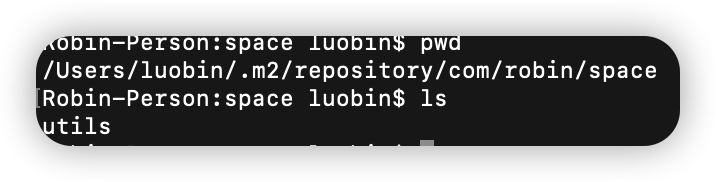

# robin空间仓库

## 本地发布
去子/父模块中分别执行:`mvn install`
本地仓库中即可发现



## 本地使用

依赖中添加
```
    <dependency>
      <groupId>com.robin.space</groupId>
      <artifactId>utils</artifactId>
      <version>1.0-SNAPSHOT</version>
    </dependency>
```
